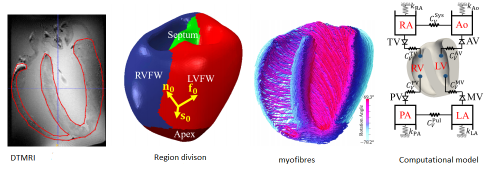
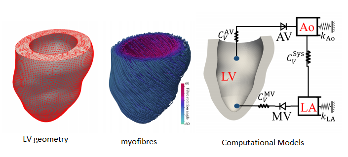

# DispersedFibresMyocardiumModelling
This is the accompany repository for the paper "Modelling of fibre dispersion and its effects on cardiac mechanics from diastole to systole". 

If you find it is useful, please cite 
"Debao Guan, Xin Zhuan, William Holmes, Xiaoyu Luo, Hao Gao, Modelling of fibre dispersion and its effects on cardiac mechanics from diastole to systole, Journal of Engineering Mathematics, under revision."

## The rabbit bi-ventricular model
<!---  )
-->

## The human left ventricular model

